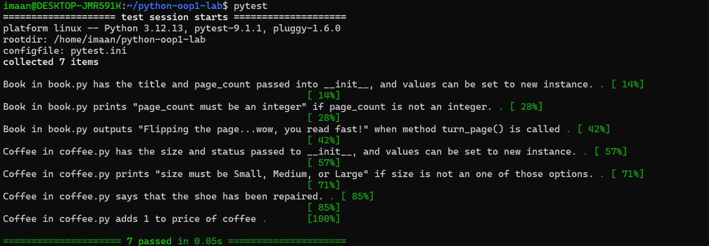

# Object Oriented Programming Lab - Bookstore

## Description

This project uses Python and Object Oriented Programming to create a simple bookstore model.

The project contains two classes:

- `Book`
- `Coffee`

## Book Class

The `Book` class has:

- `title` - the title of the book
- `page_count` - the number of pages in the book

The page count must be an integer.

### Method

- `turn_page()` - prints a message when a page is turned

## Coffee Class

The `Coffee` class has:

- `size` - the size of the coffee
- `price` - the price of the coffee

The coffee size must be `Small`, `Medium`, or `Large`.

### Method

- `tip()` - prints a message and adds 1 to the coffee price

## Testing

The project uses pytest for testing.

All tests are passing:

```text
7 passed

### Test Results 

